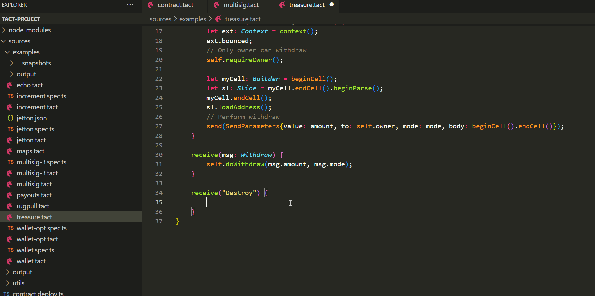
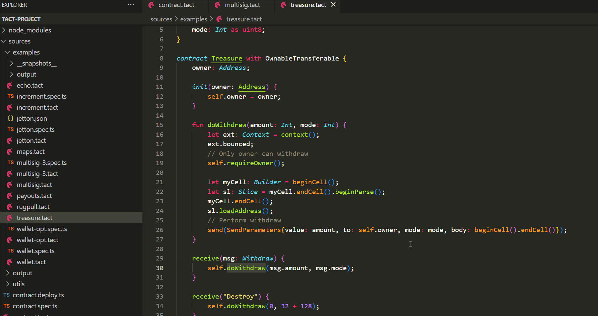

# Tact language support for Visual Studio code

<div align="center">
  
</div>


[Tact](https://tact-lang.org/) is the language used in TON blockchain project to create smart contracts.
This extension provides: 

* Syntax highlighting
* Error highlighting
* Snippets
* Additional information by hover event
* Code completion for all variables, functions, global parameters and unique types for tact
* Code completion for all contracts / libraries in the current file and all referenced imports

# Instructions

## Code completion

Autocomplete is generally supported across for smart contracts, structs, functions, variables, inheritance. Autocomplete should happen automatically or press Ctrl+Space or Command+Space.



## Error highlighting

Error highlighting can be enabled or disabled using user settings. Also a default delay is implemented for all the validations compilation as Tact compilation can be slow when you have many dependencies. This part uses Tact compiler to show errors and works by save event.

```
"tact.enabledAsYouTypeCompilationErrorCheck": true,
"tact.validationDelay": 1500
```

## Additional information by hover event

If hover on a variable with some Tact functions that pop up with the information about property will be shown.



## Contributing / Issues / Requests

For ideas, issues, additions, modifications please raise an issue or a pull request at https://github.com/ton-core/vscode-tact

# Requested features

- [x] Show hovers
- [ ] Formatter
- [ ] Auto compilation
- [ ] Help with function and method signatures
- [ ] Possible actions on errors or warnings
- [ ] Incrementally format code as the user types
- [ ] Linter